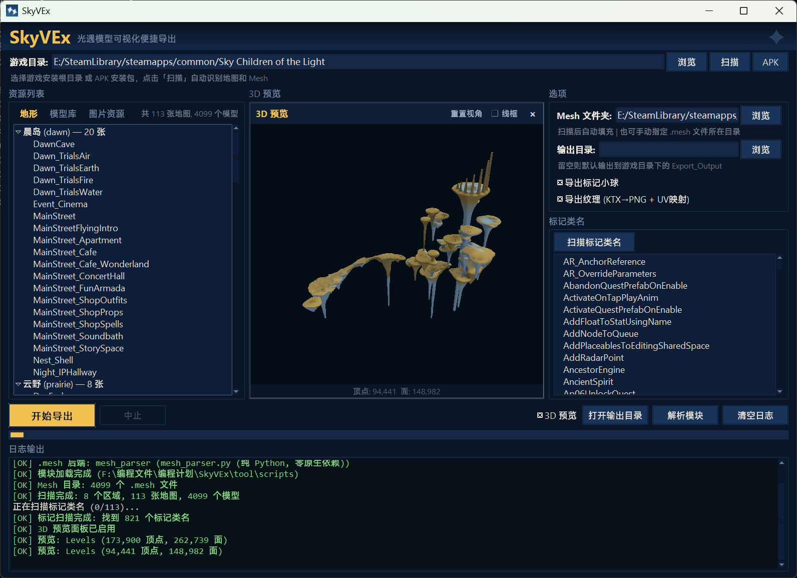

# SkyVEx

**Convenient Visualization and Export of Sky: Children of the Light Models**

GUI frontend for batch-exporting 3D map data from *Sky: Children of the Light*.

[中文](./README-zh.md) | [English](./README.md)

## What this project is

A graphical interface that wraps the community's existing map-parsing scripts, adding:

- **One-click game directory scanning** — point at your game install, auto-discover all maps and mesh files
- **Visual map selection** — scene-grouped tree with per-map checkboxes
- **Marker class filtering** — background scan with progress bar, pick which marker types to export
- **Texture extraction** — KTX (BC6H) → PNG conversion, UV mapping in OBJ, material references in MTL
- **Script manager** — view, open, and swap the underlying parsing scripts

> **The parsing scripts (terrain, mesh, bin) are NOT written by us.**
> They come from the open-source projects listed in [Credits](#credits) and [NOTICE](./NOTICE).
> We only provide the GUI wrapper and the texture extraction pipeline.

## Screenshot



## Requirements

Python 3.8+

```bash
pip install lz4 meshoptimizer texture2ddecoder Pillow
```

`texture2ddecoder` and `Pillow` are only needed for texture export. The rest works without them.

<details>
<summary>Termux (Android) — CLI scripts only, no GUI</summary>

```bash
pkg update && pkg upgrade
pkg install python clang cmake make binutils git
pip install lz4 meshoptimizer
```
</details>

## Usage

### GUI (recommended)

**Windows:** Double-click `SkyVEx.exe` in the project root.

Or run from the command line:

```bash
cd tool/scripts
python gui.py
```

1. **Browse** to your game install directory, click **Scan**
2. Check/uncheck maps in the tree
3. Toggle markers, textures, adjust output directory
4. Click **Start Export**

### CLI (original scripts)

The original command-line scripts still work independently:

```bash
python launcher.py        # Single map (interactive prompts)
python batch_export.py    # Batch export
python Sky_Bstbake.py --unpack BstBaked.meshes --export-obj  # Terrain only
python bintojson.py Objects.level.bin   # bin → json
```

## File structure & copyright

```
SkyVEx.exe                         # Windows launcher (build from SkyVEx.py)
SkyVEx.py                          # Launcher entry point
│
tool/scripts/
│
│  [Original — lingyunalingyun]
├── gui.py                     # GUI frontend & texture pipeline
│
│  [Upstream + Modified — see headers for details]
├── batch_export.py            # Batch export engine (+ texture pipeline)
├── launcher.py                # Single map CLI export (+ output_dir)
│
│  [Original — lingyunalingyun, format research by Miau]
├── bintojson.py               # TGCL .bin → .json parser
│
│  [Upstream — original authors, see NOTICE]
├── Sky_Bstbake.py             # Core terrain parser
├── sky_mesh_to_obj.py         # .mesh parser v2 (v31/v32)
├── meshtoobj.py               # .mesh parser legacy (v23–v30)
├── bstbake_standalone.py      # Standalone terrain export
└── _meshopt/
    └── meshopt2.dll           # meshopt decoder (Windows)
```

Every script file contains a header comment indicating its source and license. Please refer to those headers and the [NOTICE](./NOTICE) file for upstream licensing details.

## Modifications to upstream scripts

The following upstream files were modified. All changes are clearly marked in the file headers.

| File | What was changed |
|------|-----------------|
| `batch_export.py` | Added texture extraction pipeline: `extract_texture_name()`, `convert_ktx_to_png()`, `find_ktx_file()`; OBJ output now includes `vt` (UV coords) and `f v/vt` format; MTL output includes `map_Kd` texture references; `export_single_map()` accepts `image_dirs` parameter |
| `launcher.py` | Added optional `output_dir` parameter to `export_map()` |
| `Sky_Bstbake.py` | Fixed meshoptimizer parameter order |

All other upstream scripts are included **unmodified** from their original repositories.

## OBJ output

| Data | Description |
|------|-------------|
| Terrain | Ground mesh with normals and vertex colors |
| Models | Scene objects with transforms applied, Z-flipped for Blender |
| Markers | Colored spheres at interaction points (optional) |
| Textures | PNG files + MTL material references (optional) |

## Building the exe

Requires [PyInstaller](https://pyinstaller.org/):

```bash
pip install pyinstaller
pyinstaller --onefile --noconsole --icon=icon.ico --name SkyVEx SkyVEx.py
```

The output `dist/SkyVEx.exe` can be placed in the project root. Python must still be installed on the target machine — the exe is just a launcher, not a standalone bundle.

## Troubleshooting

| Problem | Fix |
|---------|-----|
| `lz4` / `meshoptimizer` not found | `pip install lz4 meshoptimizer` |
| Terrain 0 vertices | Check meshoptimizer install; Windows: put `meshopt2.dll` in `_meshopt/` |
| Models missing | Need `.mesh` files extracted from game assets |
| Texture export fails | `pip install texture2ddecoder Pillow` |

## Credits

**Parsing scripts** are based on work by the following authors and projects — all originally released under the MIT license:

- checion (雨人) & Heriel (落秋) — [SkyBstbake](https://github.com/ThatSkyOldServer/SkyBstbake)
- Miau — TGCL format research, [Sky-.bin-reader](https://github.com/Miau0x1/Sky-.bin-reader)
- potato — scripts

**GUI, bin parser, and texture pipeline** by lingyunalingyun.

## License

The SkyVEx GUI and texture pipeline code (`gui.py` and additions to `batch_export.py`) are released under the MIT License — see [LICENSE](./LICENSE).

The upstream parsing scripts retain their original MIT licenses — see [NOTICE](./NOTICE) for details.
